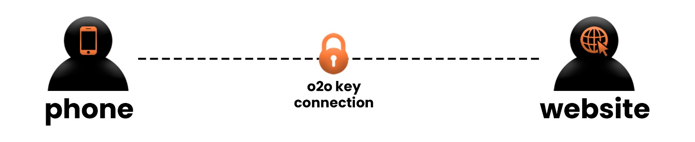

# One To One Location Share #
---

**One To One Location Share** is a platform designed for secure and real-time location sharing. It utilizes a one-to-one key connection formula, allowing only one person to be tracked at a time, and only with their explicit permission. Simply use their unique tracking key to initiate tracking.

---

**Use case:**
- **Child Safety:** Ideal for keeping track of children and ensuring their safety while they use smartphones.
- **Package Tracking:** Useful for monitoring the delivery status of packages in real-time.

---

**Features:**
- **Modern and User-Friendly UI:** The platform boasts a sleek and intuitive interface for easy navigation.
- **No Account Required:** No need to log in or create an account; just enter the required details each time you want to track someone.
- **Data Privacy:** The website does not store your data. It generates a downloadable blob for tracking history. On mobile devices, tracking data is stored locally, allowing users to keep it as long as desired or set to automatically delete after 30 days.

---

more details will be available time to time.
~ **SKRRRKID**
